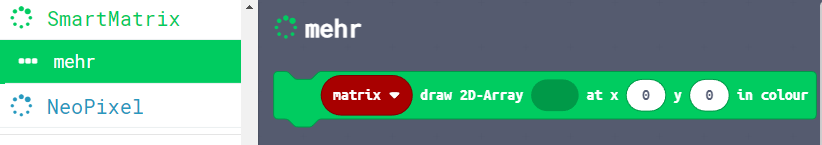
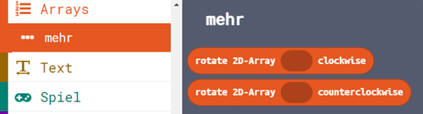

# MakeCode extension for the neopixel/WS2812B
- it should work for the Calliope mini as well as the BBC Micro:Bit
- merged functions from smartMatrix https://github.com/Shorts1999/pxt-smartmatrix and Expressive Pixels https://github.com/microsoft/ExpressivePixelsMakeCode with some minor code changes

----
### smartMatrix: draw2DArray



```blocks
let lives = 3
let matrix = SmartMatrix.create(DigitalPin.P0, 10, 10, null)
let heart = [[Colors.Red, Colors.Off, Colors.Red], [Colors.Red, Colors.Red, Colors.Red], [Colors.Off, Colors.Red, Colors.Off]]
basic.forever(function () {
    for (let Index = 0; Index <= lives - 1; Index++) {
        matrix.draw2DArray(heart, 0, Index * 3)
        matrix.show()
    }
})
```

### Array: rotate 2DArray clockwise/counterclockwise



```blocks
let heart = arrays.rotateCounterClockwise([[Colors.Red, Colors.Off, Colors.Red], [Colors.Red, Colors.Red, Colors.Red], [Colors.Off, Colors.Red, Colors.Off]])
```

> Diese Seite bei [https://jasperp92.github.io/neopixelmatrix_makecode/](https://jasperp92.github.io/neopixelmatrix_makecode/) öffnen

----
## Als Erweiterung verwenden

Dieses Repository kann als **Erweiterung** in MakeCode hinzugefügt werden.

* öffne [https://makecode.calliope.cc/](https://makecode.calliope.cc/)
* klicke auf **Neues Projekt**
* klicke auf **Erweiterungen** unter dem Zahnrad-Menü
* nach **https://github.com/jasperp92/neopixelmatrix_makecode** suchen und importieren

## Dieses Projekt bearbeiten 

Um dieses Repository in MakeCode zu bearbeiten.

* öffne [https://makecode.calliope.cc/](https://makecode.calliope.cc/)
* klicke auf **Importieren** und dann auf **Importiere URL**
* füge **https://github.com/jasperp92/neopixelmatrix_makecode** ein und klicke auf Importieren

## Blockvorschau

Dieses Bild zeigt den Blockcode vom letzten Commit im Master an.
Die Aktualisierung dieses Bildes kann einige Minuten dauern.


#### Metadaten (verwendet für Suche, Rendering)

* for PXT/calliopemini
<script src="https://makecode.com/gh-pages-embed.js"></script><script>makeCodeRender("{{ site.makecode.home_url }}", "{{ site.github.owner_name }}/{{ site.github.repository_name }}");</script>
